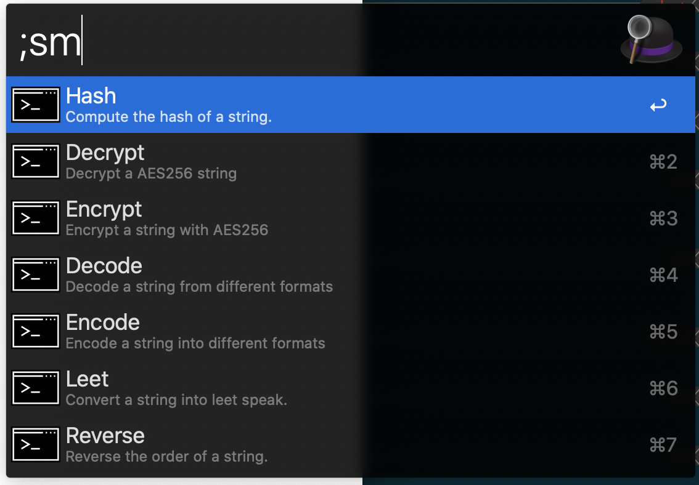
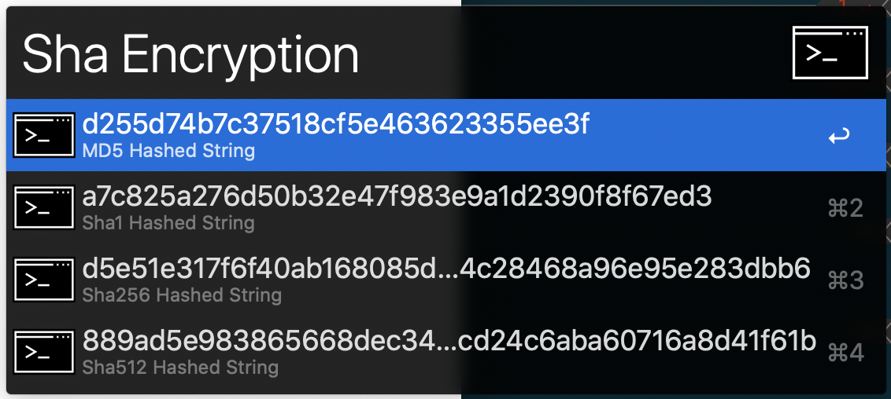

### Alfred String Manipulator

#### Feature Set

- [x] **Encode**
  - [x] Base64
  - [x] URL
  - [x] HTML
  - [x] Hex
- [x] **Decode****
  - [x] Base64
  - [x] URL
  - [x] HTML
  - [x] Hex
- [x] **Reverse**
- [x] **1337 5p34k** (Leet Speak 😁)
- [x] **Encryption**
  - [x] Secure Encryption Password Input (AES-256-GCM)
  - [x] Contents Copied to Clipboard (Concealed Type)
- [x] **Decryption**
  - [x] Secure Encryption Password Input (AES-256-GCM)
  - [x] Contents Copied to Clipboard (Concealed Type)
- [x] **Hashing**
  - [x] Sha1
  - [x] Sha256
  - [x] Sha512
  - [x] MD5

#### Screenshots

